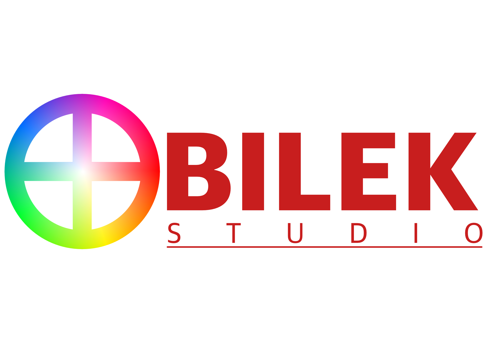
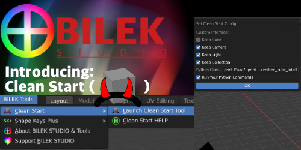
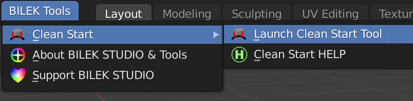
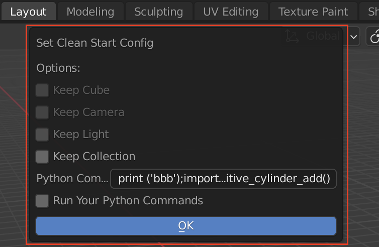
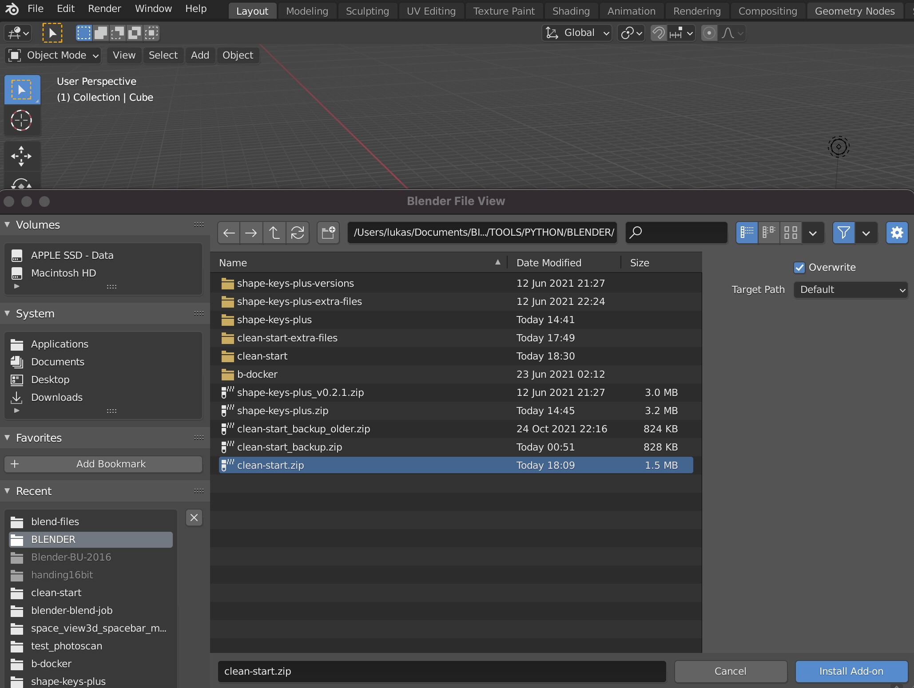

# BILEK Studio is introducing Clean Start Tool for Blender

# Clean Start ( )

Click on the picture which takes you to YouTube video.

...for duplicating and mirroring shape keys (in Maya software called Blendshapes ("BS") )

## About:

Author: Lukas Bilek. BILEK Studio.

Date created: 11 November 2021

Copyright: GPL

Contact: https://www.linkedin.com/in/lukasbilek/

How to support me: On Blender market: www.blendermarket.com or contact me on linked it and say something nice. :-)
... or send me some happy crypto. :-) Check out Support BILEK STUDIO.
    
This tool is supposed to make easier life for artists who hate default objects and want to have something extra.
You should find the buttons under Top Bar BILEK TOOLS in Blender.

## List of buttons: 

###(Top Bar) BILEK Tools > () Clean Start Tool >  :

 "Launch Clean Start Tool"

 "Clean Start HELP"

## Screenshots from Blender 2.93 LTS:

### From Top Bar:

### (Top Bar) BILEK Tools > () Clean Start Tool >> Set Clean Start Config Window :

### What it is doing:
- Managing default objects in the default scene when Blender is launched, or the new scene is created without saving.
  Also it is runing a custom script when Blender is launched.
    - **_"Keep Cube"_** - if disabled, it will remove default cube when Blender is launched again.
    - **_"Keep Camera"_** - if disabled, it will remove default Camera when Blender is launched again.
    - **_"Keep Light"_** - if disabled, it will remove default Light when Blender is launched again.
    - **_"Keep Collection"_** - if disabled, it will remove default Collection with Cube, Camera and Light objects 
      when Blender is launched again. In addition, it will disable automatically all top objects.
    - **_"Python Commands"_** - You can write your own scripts. Just to make sure, every new line in the script
      must be separated by **_";"_**
    - **_"Run Your Python Commands"_** - if enabled, it will run your custom **_"Python Commands"_** when blender is launched
      again or the new scene is created without savings.
      
- #**In version 0.1.1:**
    - So far there is known bug that I am currently working on. It is creating some extra submenus when add-on is enabled and disabled.
      I am working on it to fix it. Normally if you see something weird with buttons in submenu, just restart Blender
      and it should be fine. ... so far.
    - This addon should work with menu from Shape Keys Plus Tool as well with version 0.2.2 and above.
- ## How to install the add-on?
    - Run Blender 3D (tested on 2.93 LTS) 
    - Go to Edit > Preferences > Add-on
    - Then click on the button called "Install"
    - Select the zip file called "clean_start.zip"
    - Click on "Install Add-on"
    - Once it is added to the add-ons, then tick the box on the Add-on.
    - Then you should see BILEK Tools on Top Bar in Blender and button .
You can see an animated gif as an example:  

