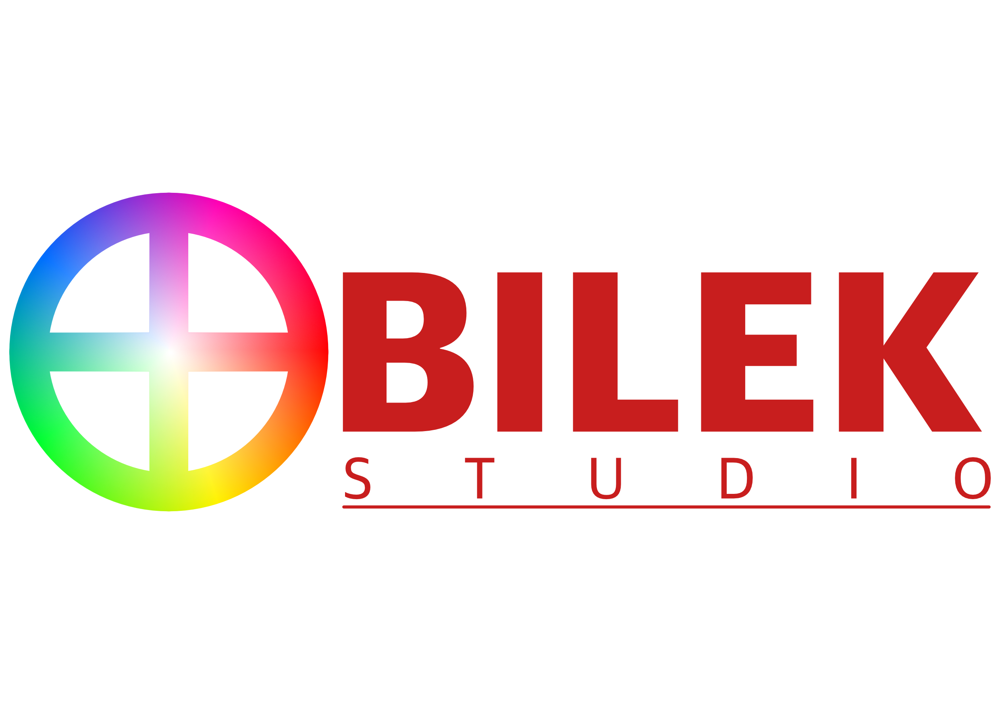
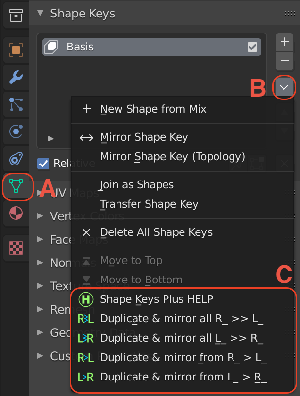

# BILEK Studio is introducing Shape Keys Plus Tool for Blender

# Shape Keys Plus ( )

Click on the picture which takes you to YouTube video.

...for duplicating and mirroring shape keys (in Maya software called Blendshapes ("BS") )

## About:

Author: Lukas Bilek. BILEK Studio.

Date created: 6 Jun 2021

Copyright: GPL

Contact: https://www.linkedin.com/in/lukasbilek/

How to support me: On Blender market: www.blendermarket.com or contact me on linked it and say something nice. :-)
    
This tools is suppose to make easier life for artist who is working with shape keys (BS).
You should find the buttons under Shape Key Specials in Shape Keys attributes.

## List of buttons: 

###(Top Bar) BILEK Tools > () Shape Keys Plus >  :

 "Duplicate & mirror from L_ > R_"

 "Duplicate & mirror from R_ > L_"

 "Duplicate & mirror all L_ >> R_"

 "Duplicate & mirror all R_ >> L_"

 "Shape Keys Plus HELP'

## Screenshots from Blender 2.93 LTS:

### From Top Bar:

### From Object Data Properties (A) > Shape Keys > Shape Key Specials >...  

### What it is doing:
- Before clicking on any buttons, you have to select one or more objects in the scene to get it work.
    - "Duplicate & mirror from L_ >> R_" is duplicating and mirroring selected shape key from L_ to R_side
       This means that it will take "L_" (l_) prefix or "_L" (l_) suffix and rename them to R after duplicating and mirroring shape keys.
       Also it is removing R_ shape keys if exist with the same name as from selected L side, just it replacing L to R 
       in the search and then remove it.
    - "Duplicate & mirror from R_ >> L_" is similar to the "Duplicate & mirror from L_ >> R_" just it works via versa.
    - "Duplicate & mirror all L_ >> R_" is removing all existing right shapes which have R preffix or suffix,
      then it duplicate each left side, mirror them and rename to R side as well.
    - "Duplicate & mirror all R_ >> L_" is same as "Duplicate & mirror all L_ >> R_" just from Right to Left sides.
    
**_What information should the tool copy when clicked on the buttons:_**

- #**In version 0.2.0:**
    - Duplicating shape keys.
    - Mirroring shape keys after duplicating.
    - Renaming Shape Keys such as [L_] [l_] [_L] [_l] (prefix and suffix) [R_] [r_] [_R] [_r]) 
    - Removing shape keys if needs to be removed for creating new shape keys.
    - Expressions - it copies some expressions, but not recommended. You will have to try it by yourself. (No guarantee)
    - Copying an attribute from Range Min in Shape Keys.
    - Copying an attribute from Range Max in Shape Keys.
    - Able to generate Shape keys with multiply / more objects.
    -  ### - Currently it does not support rig, so if there are any connection with original shape keys, it might loose the connection.

- ## How to install the add-on?
    - Run Blender 3D (2.93 LTS)
    - Go to Edit > Preferences > Add-on
    - Then click on the button called "Install"
    - Select the zip file called "shape-keys-plus.zip"
    - Click on "Install Add-on"
    - Once it is added to the add-ons, then tick the box on the Add-on.
    - Then you should see BILEK Tools on Top Bar in Blender and button .
You can see an animated gif as an example:  

      
- You can see the buttons on the other place as well such as Shape Key Specials

